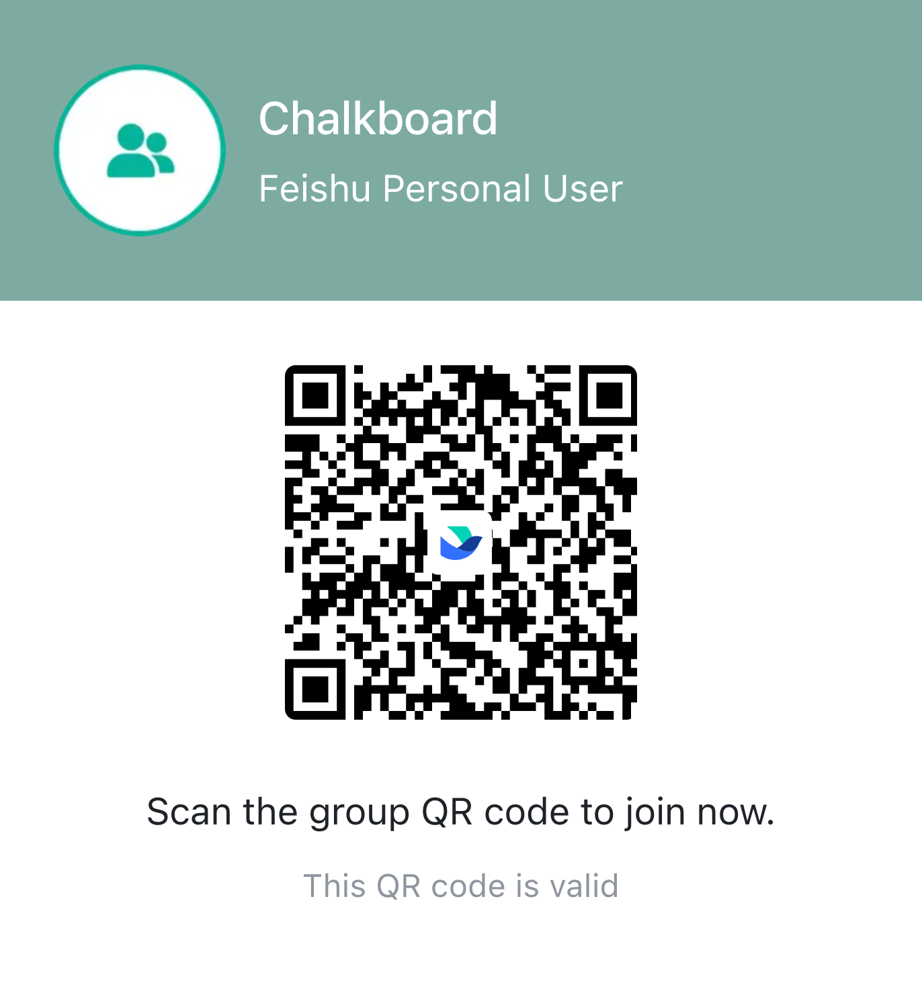

<p align="center">
  <h1 align="center">Chalkboard</h1>
  <p align="center"><b>Multi-agent collaboration through shared Markdown files</b></p>
  <p align="center"><i>Your AI agents can't talk to each other. Chalkboard fixes that.</i></p>
</p>

<p align="center">
  
  <a href="LICENSE"></a>
  
  
</p>

<p align="center">
  <a href="#quick-start">Quick Start</a> ·
  <a href="docs/architecture.md">Architecture</a> ·
  <a href="docs/use-cases.md">Use Cases</a> ·
  <a href="#community">Community</a> ·
  <a href="#contributing">Contributing</a>
</p>

---

## Overview

### The Problem

IM platforms (Feishu, Telegram, Discord, Slack) **don't let bots read each other's messages**. If you run multiple AI agents in a group chat, they are completely blind to one another — no shared context, no coordination, no collaboration.

### The Chalkboard Solution

**Chalkboard** is an open-source coordination layer that gives your AI agents three superpowers:

- **Message Poller** — fetches ALL group messages (including other bots') via platform APIs, giving every agent full conversation context
- **LLM-Powered Decision Engine** — an AI judge reads the conversation and intelligently decides which agent should act next
- **Two-Step Trigger + Forward** — triggers the right agent, captures its response, and posts it back to the group chat

No database. No server. No external dependencies. Just Python + files.

```
User: "@AgentA Research NVDA, let AgentB review"

  Chalkboard daemon (every 5 seconds):
    1. Poller    → fetches all group messages (Feishu/Telegram API)
    2. LLM Judge → "AgentA finished research, AgentB should review now"
    3. Trigger   → injects context into AgentB's session
    4. Forward   → captures AgentB's reply → posts to group chat
    5. Done      → zero manual intervention
```

---

## Key Features

| Feature | Description |
|---------|-------------|
| **LLM Decision Engine** | AI judge reads chat context and decides which agent should act — handles nuance that regex rules can't |
| **Message Poller** | Fetches ALL group messages via Feishu/Telegram API, including other bots' messages |
| **Response Forwarding** | Captures agent output and reliably posts it to the group chat |
| **Pluggable LLM Providers** | Supports Anthropic (Claude), OpenAI (GPT), or any compatible endpoint for the judge |
| **Agent Auto-Discovery** | `bb agents` scans your machine for OpenClaw profiles and group chats |
| **Board Templates** | `--template research/code-review/brainstorm/content` for structured multi-round tasks |
| **Turn Control** | Prevents agents from working out of order or marking others' TODOs |
| **Cross-Platform** | Feishu + Telegram providers with pluggable design for more |
| **Zero Dependencies** | Pure Python 3.8+ standard library — no pip install needed |

---

## Quick Start

### Prerequisites

- **Python**: 3.8 or higher
- **OpenClaw**: 2+ agent profiles running on the same machine ([github.com/openclaw/openclaw](https://github.com/openclaw/openclaw))
- **LLM API Key**: Anthropic or OpenAI (for the decision engine)

### 1. Install

```bash
git clone https://github.com/link-ship-it/chalkboard.git
cd chalkboard
```

### 2. Discover Your Agents

```bash
python3 scripts/board.py agents
```

Auto-detects all OpenClaw agents and group chats on your machine:

```
Found 2 agent(s):

  Profile         Name          Config Dir
  --------------- ------------- ----------------
  default         Alice         ~/.openclaw
  alpha           Bob           ~/.openclaw-alpha

Found 3 group chat(s):

  Channel      Chat ID              Name
  ------------ -------------------- --------
  feishu       oc_abc123...         my-team

Suggested init command:

  bb init \
    --agents "Alice,Bob" \
    --profiles "default,alpha" \
    --channel feishu \
    --notify-target oc_abc123... \
    --enable-poller
```

### 3. Initialize

Copy and run the suggested command from step 2:

```bash
bb init \
  --agents "Alice,Bob" \
  --profiles "default,alpha" \
  --channel feishu \
  --notify-target oc_abc123... \
  --enable-poller
```

This automatically:

- Creates `~/.chalkboard/` directory structure
- Installs the Chalkboard skill to all OpenClaw profiles
- Generates `config.json` with agents, sessions, and credentials (auto-discovered)
- Sets up a launchd daemon that runs every 5 seconds
- Configures the LLM judge for intelligent decision-making

### 4. Configure LLM Judge

Add your API key to `~/.chalkboard/.env`:

```bash
echo 'export ANTHROPIC_API_KEY="your-key-here"' > ~/.chalkboard/.env
chmod 600 ~/.chalkboard/.env
```

Add the judge config to `~/.chalkboard/config.json`:

```json
{
  "judge": {
    "provider": "anthropic",
    "model": "claude-sonnet-4-5-20250514",
    "api_key_env": "ANTHROPIC_API_KEY"
  }
}
```

Supported providers:

| Provider | Model Examples | API Key Env |
|----------|---------------|-------------|
| `anthropic` | `claude-sonnet-4-5-20250514`, `claude-haiku-3-5-20241022` | `ANTHROPIC_API_KEY` |
| `openai` | `gpt-4o-mini`, `gpt-4o` | `OPENAI_API_KEY` |

### 5. Start Collaborating

Tell any agent in your group chat:

> "@Alice Research Tesla, let Bob review when done"

The daemon handles the rest automatically:

1. Alice responds via normal IM webhook (does research, posts results)
2. Poller captures Alice's response
3. LLM Judge: *"Alice completed research and asked Bob to review. Bob should act."*
4. Bob is triggered, does the review, response forwarded to group
5. Done — zero manual intervention

---

## How It Works

### Architecture

```
┌──────────────┐  ┌──────────────┐
│   Agent A    │  │   Agent B    │
│  (Feishu)    │  │  (Telegram)  │
└──────┬───────┘  └──────┬───────┘
       │                 │
       ▼                 ▼
┌─────────────────────────────────────────────────┐
│              ~/.chalkboard/                      │
│                                                  │
│  boards/        Task boards (Markdown + TODOs)   │
│  context/       Group messages (JSONL)            │
│  config.json    Agents, sessions, credentials    │
│  daemon.sh      Generated daemon script          │
│  .env           API keys (secure, not in git)    │
└─────────────────────────────────────────────────┘
       │
┌──────▼──────────────────────────────────────────┐
│  Chalkboard Daemon (launchd, every 5s)           │
│                                                  │
│  1. poller.py   → Fetch ALL group messages       │
│                   (Feishu API / Telegram API)     │
│                                                  │
│  2. judge.py    → LLM reads conversation          │
│                   "Which agent should act?"        │
│                                                  │
│  3. decide.py   → Trigger agent via session       │
│                   inject, capture response,        │
│                   forward to group chat            │
└─────────────────────────────────────────────────┘
```

### Decision Engine

The LLM judge receives the last 10 messages and the agent roster, then returns a structured decision:

```
Input:  [16:30] user: Research PDD, let Bob review
        [16:31] Alice [bot]: Research done. Key findings: ...@Bob review please

Output: {"trigger": "Bob", "reason": "Alice completed research and asked Bob to review"}
```

The judge understands context that regex rules can't:

- Old requests vs new requests (timestamp awareness)
- Casual mentions vs explicit handoffs (intent understanding)
- Card messages with placeholder text (infers from surrounding context)
- Multiple agents mentioned (knows who should act next)

### Two-Step Trigger + Forward

Instead of relying on agents to post their own replies (unreliable across IM platforms), Chalkboard captures and forwards:

```
Step 1: openclaw agent --session-id xxx --message "context + task" --json
        → Agent executes, response captured as JSON

Step 2: openclaw message send --channel feishu --target group-id --message "response"
        → Response appears in the group chat
```

---

## CLI Reference

| Command | Description |
|---------|-------------|
| `bb agents` | Auto-discover agents and group chats |
| `bb init` | Set up Chalkboard (skill, daemon, poller, config) |
| `bb create` | Create a task board (`--template` for presets) |
| `bb list` | List all active tasks |
| `bb read <id>` | Read a task board |
| `bb log <id>` | Append a work log entry |
| `bb todo <id> --add` | Add a TODO for an agent |
| `bb todo <id> --done` | Mark a TODO as complete (identity-checked) |
| `bb my-todos --agent <name>` | Show pending TODOs (supports aliases) |
| `bb complete <id>` | Archive a completed task |
| `bb poller status` | Show daemon status |
| `bb poller start/stop` | Manage the daemon |
| `bb context --group <id>` | View recent group messages |

## Templates

Skip manual TODO setup with built-in collaboration templates:

```bash
bb create --title "..." --assign alice,bob --template research
bb create --title "..." --assign alice,bob --template code-review
bb create --title "..." --assign alice,bob --template brainstorm
bb create --title "..." --assign alice,bob,charlie --template content
```

| Template | Rounds | Flow |
|----------|--------|------|
| `research` | 3 | A researches → B researches → A synthesizes |
| `code-review` | 3 | A security review → B perf review → A summary |
| `brainstorm` | 3 | A proposes ideas → B ranks → A plans top 3 |
| `content` | 4 | A gathers sources → B drafts → A reviews → B finalizes |

---

## Configuration

### Environment Variables

| Variable | Default | Description |
|----------|---------|-------------|
| `CHALKBOARD_BOARD_DIR` | `~/.chalkboard/boards` | Active task boards |
| `CHALKBOARD_ARCHIVE_DIR` | `~/.chalkboard/archive` | Completed tasks |
| `CHALKBOARD_CONTEXT_DIR` | `~/.chalkboard/context` | Polled message storage |
| `CHALKBOARD_AGENT_ID` | (empty) | Agent identity for TODO ownership |
| `ANTHROPIC_API_KEY` | (empty) | API key for LLM judge (Anthropic) |
| `OPENAI_API_KEY` | (empty) | API key for LLM judge (OpenAI) |

### Config File (`~/.chalkboard/config.json`)

```json
{
  "groups": {
    "oc_abc123": {
      "provider": "feishu",
      "poll_interval": 5,
      "agents": [
        {"name": "alice", "profile": "default", "session_id": "auto-discovered", "aliases": ["Alice"]},
        {"name": "bob", "profile": "alpha", "session_id": "auto-discovered", "aliases": ["Bob"]}
      ]
    }
  },
  "feishu": {"app_id": "from-openclaw-config", "app_secret": "from-openclaw-config"},
  "judge": {"provider": "anthropic", "model": "claude-sonnet-4-5-20250514", "api_key_env": "ANTHROPIC_API_KEY"}
}
```

> **Security**: API keys are stored in `~/.chalkboard/.env` (chmod 600), never in config.json. The `api_key_env` field points to an environment variable name, not the key itself.

---

## Advanced Usage

### Without OpenClaw

Chalkboard's board system works standalone. Any tool that can run shell commands can use it:

```bash
# Create a task
python3 scripts/board.py create --title "Review PR #42" --assign reviewer-1,reviewer-2

# Log work
python3 scripts/board.py log task-001 --agent reviewer-1 --content "LGTM, minor style issues"

# Check TODOs
python3 scripts/board.py my-todos --agent reviewer-2
```

The poller and decision engine require OpenClaw for agent triggering, but boards work independently.

### Custom LLM Provider

Use any OpenAI-compatible endpoint:

```json
{
  "judge": {
    "provider": "openai",
    "model": "your-model",
    "api_key_env": "YOUR_API_KEY",
    "base_url": "https://your-endpoint.com/v1"
  }
}
```

---

## Project Structure

```
chalkboard/
├── scripts/
│   ├── board.py          # Core CLI — task boards, TODOs, templates (1169 lines)
│   ├── poller.py         # Message polling — Feishu + Telegram providers (362 lines)
│   ├── judge.py          # LLM judge — pluggable decision engine (190 lines)
│   ├── decide.py         # Decision engine — trigger + forward (324 lines)
│   └── check_todos.py    # Legacy TODO checker for cron fallback (132 lines)
├── docs/
│   ├── architecture.md   # Deep dive into how it works
│   ├── quickstart.md     # Step-by-step setup guide
│   └── use-cases.md      # Real-world collaboration patterns
├── examples/
│   ├── stock-research/   # Two agents research a stock
│   └── content-ops/      # Content pipeline with multiple agents
├── SKILL.md              # OpenClaw skill definition
├── bb                    # Shell wrapper for quick CLI access
├── config.example.yaml   # Example configuration
├── LICENSE               # MIT License
└── README.md
```

---

## Community

Join our Feishu group to discuss Chalkboard, share your multi-agent setups, and get help:

<p align="center">
  
  <br>
  <sub>Scan with Feishu to join the Chalkboard community group</sub>
</p>

---

## Contributing

Chalkboard is in its early stages, and we welcome contributions of all kinds:

- **Bug Reports**: Open an [issue](https://github.com/link-ship-it/chalkboard/issues) with reproduction steps
- **Feature Requests**: Describe your use case in an issue
- **Pull Requests**: Fork, branch, and submit — we review promptly
- **Documentation**: Improvements to docs, examples, and translations
- **New Providers**: Add support for Discord, Slack, WhatsApp, or other platforms

### Development Setup

```bash
git clone https://github.com/link-ship-it/chalkboard.git
cd chalkboard
# No dependencies to install — pure Python stdlib
python3 scripts/board.py --help
```

---

## License

This project is licensed under the [MIT License](LICENSE).

---

<p align="center">
  <sub>Built for <a href="https://github.com/openclaw/openclaw">OpenClaw</a> — the open-source AI agent platform</sub>
</p>
